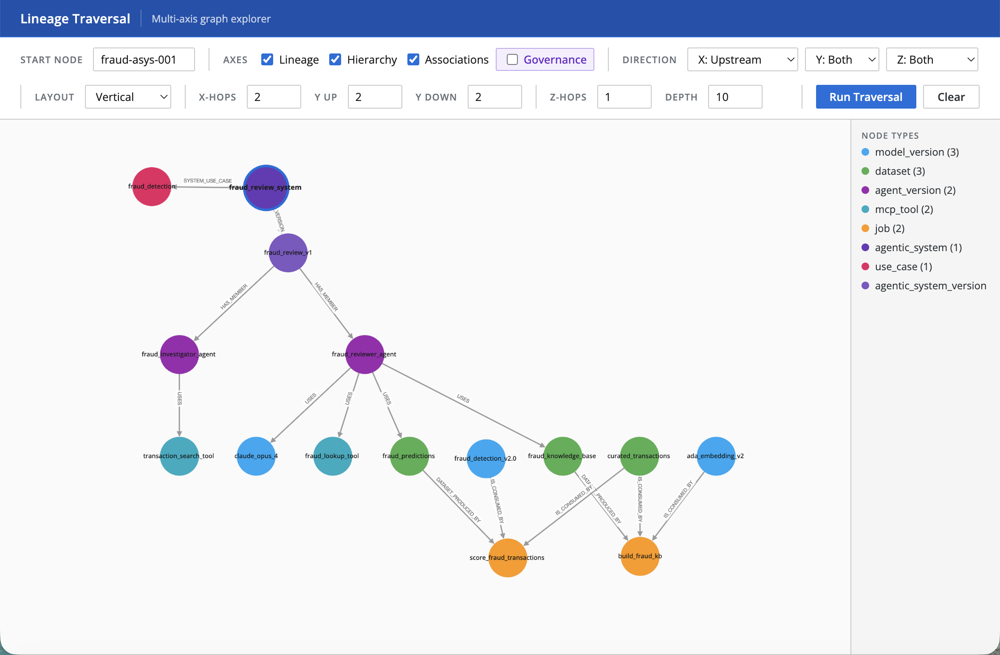
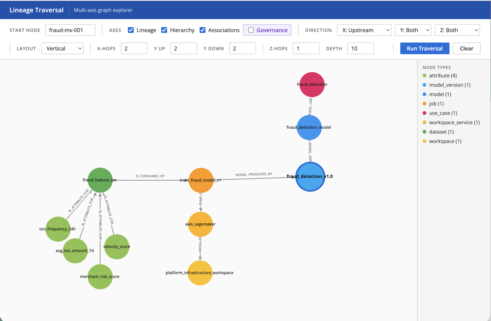
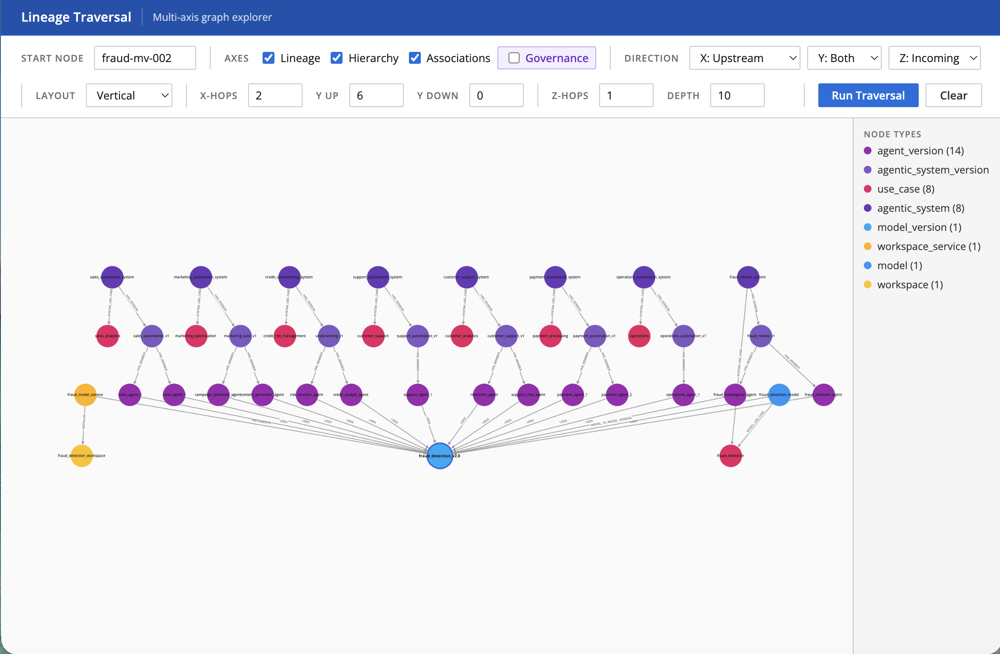
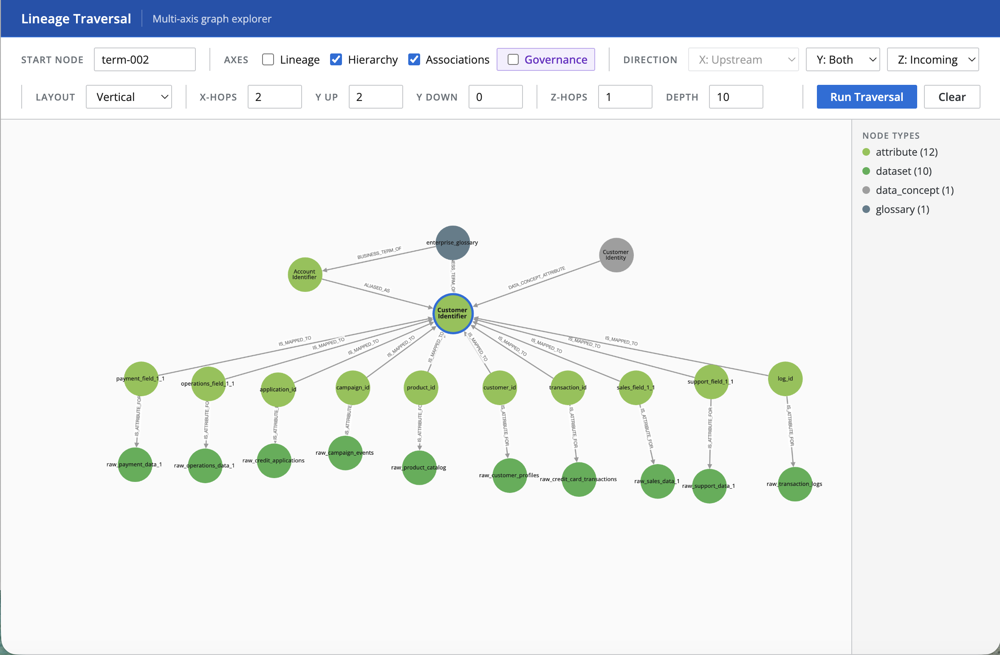
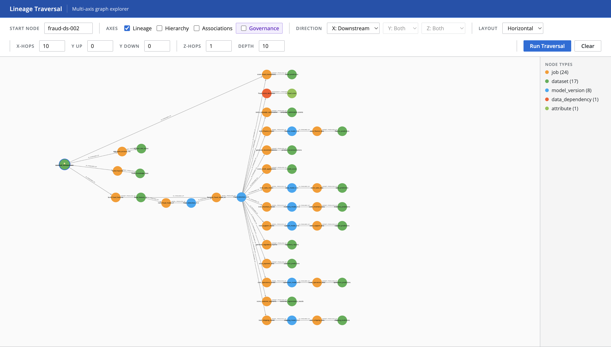
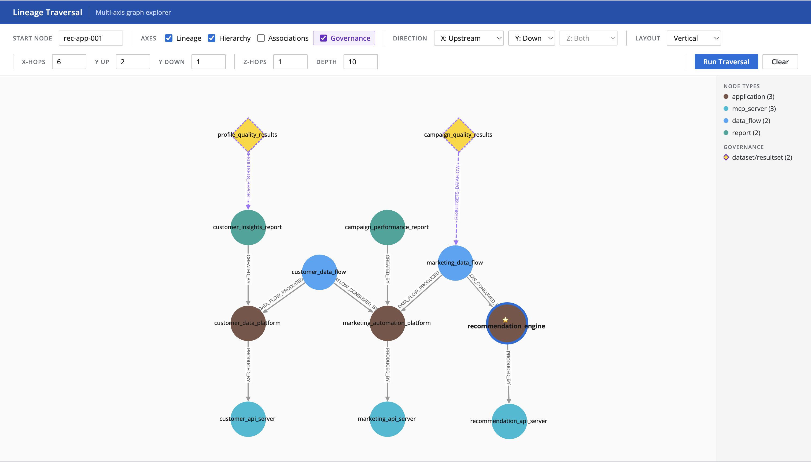
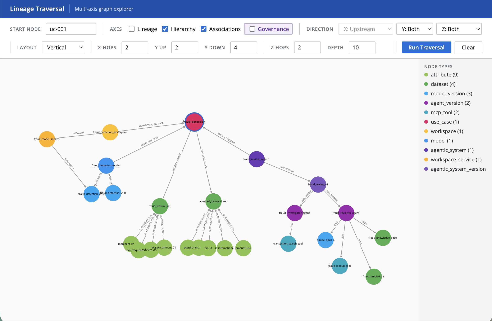

# Graph Analytics with Neo4j

A modular graph analytics system for building and querying knowledge graphs with Neo4j

## Project Structure

```
lineage-poc/
├── backend/                     # FastAPI backend service
│   ├── api.py                  # RESTful API endpoints
│   ├── requirements.txt        # Python dependencies
│   └── Dockerfile              # Backend container config
│
├── metamodel/
│   ├── schema.yaml             # Metamodel schema 
│   └── entities.yaml           # Entity data
|
├── src/
│   ├── graph/
│   │   ├── loader.py           # Neo4j graph loading
│   └── utils.py                # Shared utilities and configuration
│
├── scripts/
│   ├── setup_graph.py          # Setup Neo4j graph from metamodel
│
├── docker-compose.yml          # Complete infrastructure stack
├── requirements.txt
└── README.md
```

## Prerequisites

- Docker and Docker Compose
- Python 3.8+
- pip

## Quick Start

Start all services (Neo4j, Backend API) with a single command:

```bash
docker-compose up -d
```
This will start:
- **Neo4j** at `http://localhost:7474` (Browser UI) and `bolt://localhost:7687` (Database)
  - Username: `neo4j`
  - Password: `password`
- **Backend API** at `http://localhost:8000` (API docs at `/docs`)


## Usage

### 1. Load Data into Neo4j

Load your metamodel data into Neo4j:

```bash
# Install dependencies first
pip install -r requirements.txt

# Load the graph
python scripts/setup_graph.py
```

This will:
- Load entities from `metamodel/entities.yaml`
- Create nodes and relationships in Neo4j
- Generate Node2Vec embeddings using Graph Data Science (GDS)

### 2. Explore with the Visual Interface

Open your browser and navigate to:
- **API Documentation**: `http://localhost:8000/docs`
- **Neo4j Browser**: `http://localhost:7474`


### Use Cases

Explore common lineage queries using the multi-axis traversal engine.

---

#### 1. 🤖 **Agentic System Lineage**
> *What are the complete upstream data sources for this agentic system?*

<details>
<summary><b>📋 View Parameters</b></summary>

| Parameter | Value |
|-----------|-------|
| **Base Node** | `fraud-asysv-001` |
| **Lineage (X-axis)** | ✅ On, Upstream |
| **Hierarchy (Y-axis)** | ✅ On |
| **Association (Z-axis)** | ✅ On, Outgoing |
| **Governance (G-axis)** | ❌ Off |

</details>



---

#### 2. 🏗️ **Model Infrastructure Lineage**
> *Where was this model developed and using what components?*

<details>
<summary><b>📋 View Parameters</b></summary>

| Parameter | Value |
|-----------|-------|
| **Base Node** | `fraud-mv-001` |
| **Lineage (X-axis)** | ✅ On, Upstream |
| **Hierarchy (Y-axis)** | ✅ On |
| **Association (Z-axis)** | ✅ On, Outgoing |
| **Governance (G-axis)** | ❌ Off |

</details>



---

#### 3. 💥 **Model Deprecation Impact Analysis**
> *If this Model Version was deprecated, what Use Cases are impacted?*

<details>
<summary><b>📋 View Parameters</b></summary>

| Parameter | Value |
|-----------|-------|
| **Base Node** | `fraud-mv-002` |
| **Lineage (X-axis)** | ❌ Off |
| **Hierarchy (Y-axis)** | ✅ On (6+ hops) |
| **Association (Z-axis)** | ✅ On, Incoming |
| **Governance (G-axis)** | ❌ Off |

</details>



---

#### 4. 📚 **Glossary Term Impact Analysis**
> *If this Business Element Term is edited, what Attributes are impacted?*

<details>
<summary><b>📋 View Parameters</b></summary>

| Parameter | Value |
|-----------|-------|
| **Base Node** | `term-002` |
| **Lineage (X-axis)** | ❌ Off |
| **Hierarchy (Y-axis)** | ✅ On |
| **Association (Z-axis)** | ✅ On |
| **Governance (G-axis)** | ❌ Off |

</details>



---

#### 5. 📊 **Downstream, Data-Only Lineage**
> *How many downstream consumer systems do I have, how critical are they?*

<details>
<summary><b>📋 View Parameters</b></summary>

| Parameter | Value |
|-----------|-------|
| **Base Node** | `fraud-ds-002` |
| **Lineage (X-axis)** | ✅ On, Downstream |
| **Hierarchy (Y-axis)** | ❌ Off |
| **Association (Z-axis)** | ❌ Off |
| **Governance (G-axis)** | ❌ Off |

</details>



---

#### 6. ✅ **Data Quality Monitoring**
> *Is the data I'm receiving complete & accurate?*

<details>
<summary><b>📋 View Parameters</b></summary>

| Parameter | Value |
|-----------|-------|
| **Base Node** | `risk-app-001` |
| **Lineage (X-axis)** | ✅ On |
| **Hierarchy (Y-axis)** | ❌ Off |
| **Association (Z-axis)** | ❌ Off |
| **Governance (G-axis)** | ✅ On |

</details>



#### 7. 🎯 **Use Case Exploration**
> *All the things in my Use Case*

<details>
<summary><b>📋 View Parameters</b></summary>

| Parameter | Value |
|-----------|-------|
| **Base Node** | `uc-001` |
| **Lineage (X-axis)** | ❌ Off |
| **Hierarchy (Y-axis)** | ✅ On |
| **Association (Z-axis)** | ✅ On, Both |
| **Governance (G-axis)** | ❌ Off |

</details>



---


## Configuration

Environment variables (optional):

```bash
# Neo4j
export NEO4J_URI="bolt://localhost:7687"
export NEO4J_USER="neo4j"
export NEO4J_PASSWORD="password"
```

### Stopping Services

```bash
# Stop all services
docker-compose down

# Stop and remove volumes (WARNING: deletes all data)
docker-compose down -v

